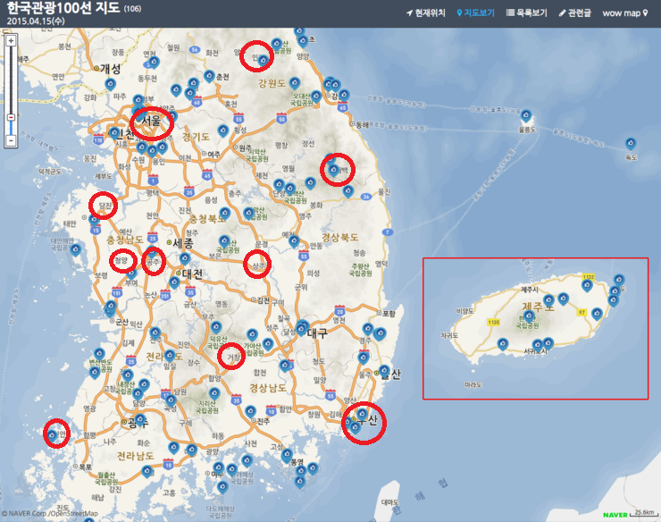

<html>
<head>
</head>
<body>

  <map name="koreanmap">
    <area href="http://tour.gongju.go.kr" shape="rect" coords="160,284,180,296"
      alt="Beach hut" title="Attraction of Gongju">
	<area href="http://tour.shinan.go.kr" shape="rect" coords="52,475,80,493"
      alt="Beach hut" title="Attraction of Shinan">  
	<area href="http://tour.taebaek.go.kr" shape="rect" coords="368,178,389,200"
      alt="Beach hut" title="Attraction of Taebaek">    
	<area href="http://tour.cheongyang.go.kr" shape="rect" coords="80,110,135,180"
      alt="Beach hut" title="Attraction of cheongyang">  
	<area href="http://tour.inje.go.kr" shape="rect" coords="254,38,280,65"
      alt="Beach hut" title="Attraction of Inje">  
	 <area href="http://tour.dangjin.go.kr" shape="rect" coords="59,75,104,210"
      alt="Beach hut" title="Attraction of dangjin">  
	 <area href="http://www.citytourbusan.com" shape="rect" coords="311,350,363,400"
      alt="Beach hut" title="Attraction of busan">  
	 <area href="http://tour.jongno.go.kr" shape="rect" coords="134,108,167,125"
      alt="Beach hut" title="Attraction of seoul">  
	
  </map>

</body>

</html>
